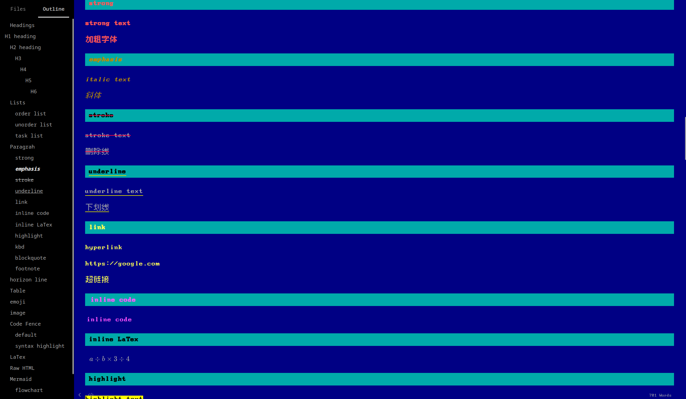
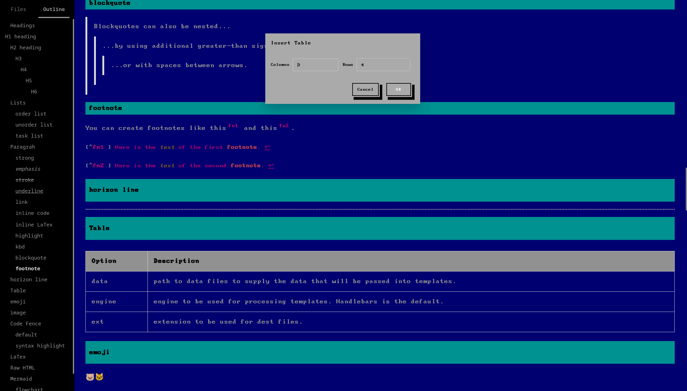
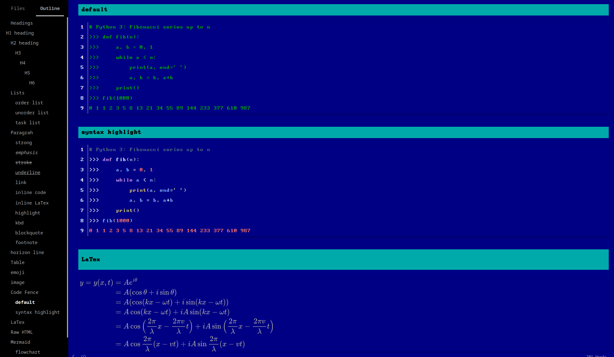
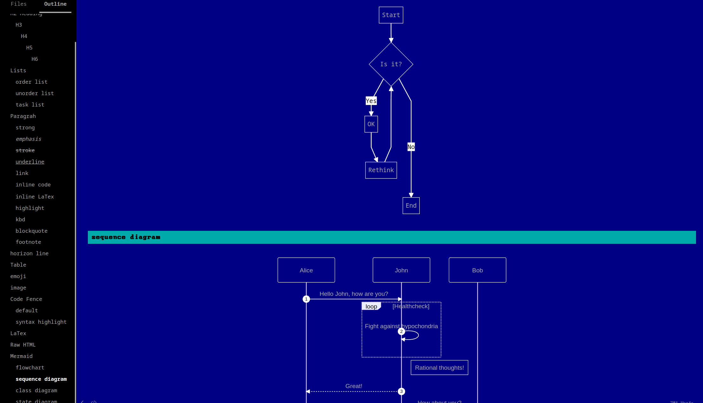
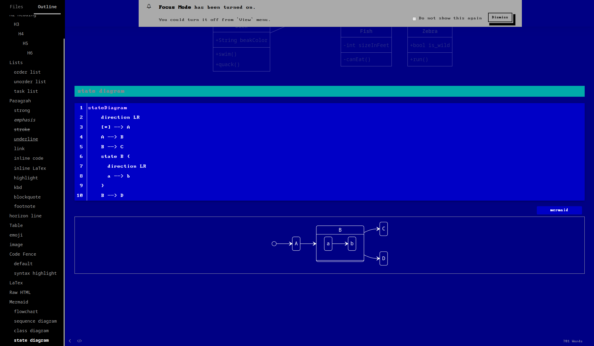
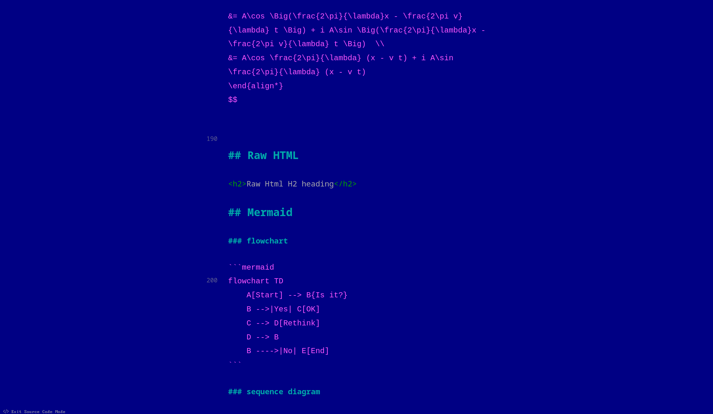

# Typora Theme Bios

> Designed and tested on Linux/Windows. Not fully tested, but should work for MacOS. 

Bios is a theme of typora, sprit from [BOOTSTRA.386](https://github.com/kristopolous/BOOTSTRA.386).

Base on three opensourced fonts: 

- [IBMVGA](https://int10h.org/oldschool-pc-fonts/fontlist/font?ibm_vga_8x14)

- [Hack Nerd](https://github.com/ryanoasis/nerd-fonts/tree/master/patched-fonts/Hack)

- [Cubic](https://github.com/ACh-K/Cubic-11)

## Preview

## Installation

1. Dowload or clone this repository.
2. Move `bios.css` and `fonts` folder into Typora’s theme folder.[^1]

[^1]: [How to install a theme for Typora](https://theme.typora.io/doc/Install-Theme/)

## Custom

If you dislike the brackground color or fonts you can change the global variables’ property in `:root` pseudo-class of `bios.css` , others’ cascading style not in  `:root` as well.

## Reporting/Contributing

If you have any issues or suggestions, open a issue or PR.
