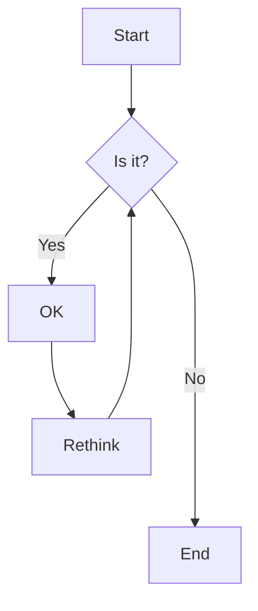
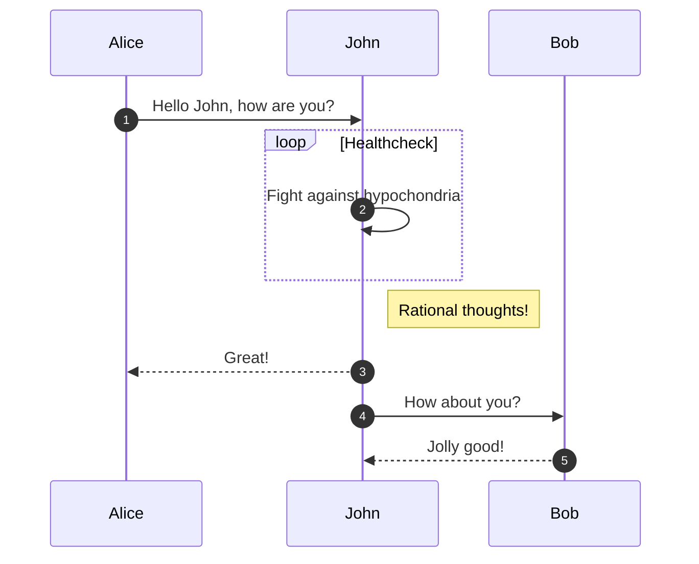
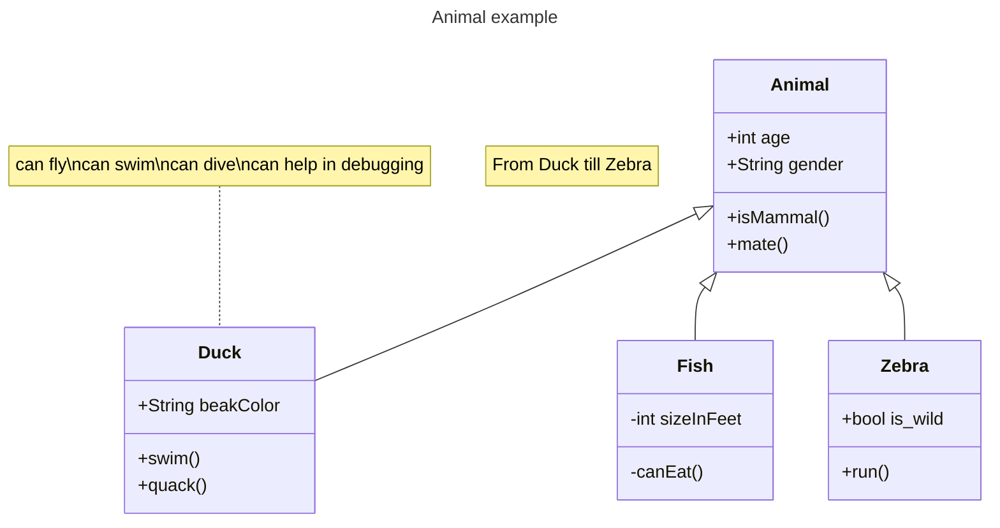
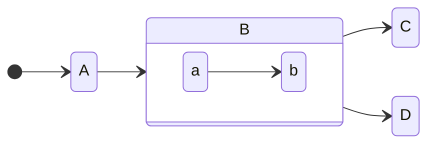

---

Part: front matter
Title: Makrdown-Template
Author: cyberpelican
---

[TOC]

## Headings

# H1 heading

## H2 heading

### H3

#### H4

##### H5

###### H6

## Lists

### order list

1. Lion King
2. Snow White
   1. Alice Wonderland
   2. Mulan

### unorder list

- Create a list by starting a line with `+`, `-`, or `*`
- Sub-lists are made by indenting 2 spaces:

  - Marker character change forces new list start:

    * Ac tristique libero volutpat at

    + Facilisis in pretium nisl aliquet

    - Nulla volutpat aliquam velit

- Very easy!

### task list

- [ ] task list item unfinished
- [x] task list item finished

## Paragrah

Typora gives you a seamless experience as both a reader and a writer. It removes the preview window, mode switcher, syntax symbols of markdown  source code, and all other unnecessary distractions. Instead, it  provides a real live preview feature to help you concentrate on the  content itself.

Typora 给你阅读和写作带来无缝的体验。不需要预览窗口，模式切换，甚至不需要了解 Markdown 的语法，无需关注各种各样让人分心的元素。它提供实时预览以帮助你更加关注内容本身

### **strong**

**strong text**

**加粗字体**

### *emphasis*

*italic text*

*斜体*

### ~~stroke~~

~~stroke text~~

~~删除线~~

### <u>underline</u>

<u>underline text</u>

<u>下划线</u>

### [link]()

[hyperlink]()

https://google.com

[超链接]()

### `inline code`

`inline code`

### inline LaTex

 $a \div b\times 3\div 4$ 

### highlight

==highlight text==

==高亮==

### kbd

<kbd>ctrl + E</kbd>

### blockquote

> Blockquotes can also be nested...
>
> > ...by using additional greater-than signs right next to each other...
> >
> > > ...or with spaces between arrows.

### footnote

You can create footnotes like this[^fn1] and this[^fn2].

[^fn1]: Here is the *text* of the first **footnote**.
[^fn2]: Here is the *text* of the second **footnote**.

## horizon line

---

## Table

| Option | Description                                                  |
| ------ | ------------------------------------------------------------ |
| data   | path to data files to supply the data that will be passed into templates. |
| engine | engine to be used for processing templates. Handlebars is the default. |
| ext    | extension to be used for dest files.                         |

## emoji

:pig::cat:

## image


## Code Fence

### default

```
# Python 3: Fibonacci series up to n
>>> def fib(n):
>>>     a, b = 0, 1
>>>     while a < n:
>>>         print(a, end=' ')
>>>         a, b = b, a+b
>>>     print()
>>> fib(1000)
0 1 1 2 3 5 8 13 21 34 55 89 144 233 377 610 987
```

### syntax highlight

```python
# Python 3: Fibonacci series up to n
>>> def fib(n):
>>>     a, b = 0, 1
>>>     while a < n:
>>>         print(a, end=' ')
>>>         a, b = b, a+b
>>>     print()
>>> fib(1000)
0 1 1 2 3 5 8 13 21 34 55 89 144 233 377 610 987
```

## LaTex

$$
\begin{align*}
y = y(x,t) &= A e^{i\theta} \\
&= A (\cos \theta + i \sin \theta) \\
&= A (\cos(kx - \omega t) + i \sin(kx - \omega t)) \\
&= A\cos(kx - \omega t) + i A\sin(kx - \omega t)  \\
&= A\cos \Big(\frac{2\pi}{\lambda}x - \frac{2\pi v}{\lambda} t \Big) + i A\sin \Big(\frac{2\pi}{\lambda}x - \frac{2\pi v}{\lambda} t \Big)  \\
&= A\cos \frac{2\pi}{\lambda} (x - v t) + i A\sin \frac{2\pi}{\lambda} (x - v t)	
\end{align*}
$$


## Raw HTML

<h2>Raw Html H2 heading</h2>

<div style="height:50px;width:50px;background:red;"></div>

## Mermaid

### flowchart



### sequence diagram



### class diagram



### state diagram




